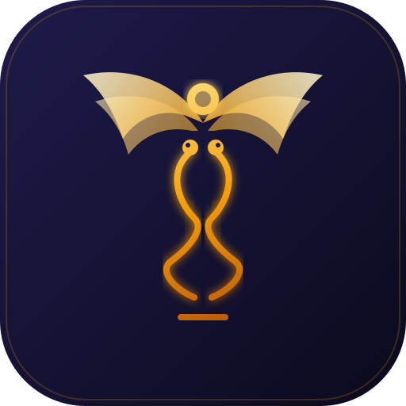

<p align="center">
  
</p>

<h1 align="center">Hermes Agent</h1>

<p align="center">
  <strong>基于 OpenClaw 的 Android AI Agent 可视化管理应用</strong>
</p>

<p align="center">
  <a href="https://github.com/JunWan666/openclaw-termux-zh">上游项目</a> •
  <a href="#快速开始">快速开始</a> •
  <a href="#功能特性">功能特性</a> •
  <a href="#架构说明">架构说明</a> •
  <a href="#构建指南">构建指南</a>
</p>

<p align="center">
  
  
  
  
  
</p>

---

## 项目简介

**Hermes Agent** 是一款 Android 端的 AI Agent 可视化管理应用，基于 [openclaw-termux-zh](https://github.com/JunWan666/openclaw-termux-zh) 上游项目深度定制开发。

与上游项目的定位不同，Hermes Agent 更侧重于：

- **可视化管理**：通过 Flutter 构建的中文界面，一站式管理 Gateway、Node 节点、AI 提供商和本地模型
- **设备能力接入**：将 Android 手机的硬件能力（摄像头、GPS、传感器、无障碍服务等）通过 OpenClaw Node Protocol 暴露给 AI
- **本地模型支持**：集成 llama.cpp，支持在手机上运行 GGUF 模型并进行本地对话
- **无障碍自动化**：集成 AccessibilityService，让 AI 能够理解屏幕内容、操控 UI 元素

### 与上游的关系

```
┌─────────────────────────────────────────────────────┐
│  mithun50/openclaw-termux    (原始 Android 集成)     │
│        ↓ fork                                         │
│  TIANLI0/openclaw-termux     (汉化分支)              │
│        ↓ fork + 整合                                  │
│  JunWan666/openclaw-termux-zh (中文社区维护版)        │
│        ↓ 深度定制                                     │
│  ★ Hermes Agent ★            (本项目)                │
└─────────────────────────────────────────────────────┘
```

本项目在上游基础上新增了：
- **无障碍服务能力 (AccessibilityCapability)** — AI 可通过 Node 协议操控手机 UI
- **ML Kit OCR** — 补充 AccessibilityService 无法获取的文字（Canvas、WebView、图片内文字）
- **本地模型对话** — 集成 llama.cpp + GGUF 模型管理与流式对话
- **节点能力扩展** — 更完整的 Capability Handler 架构

---

## 功能特性

### 🤖 AI Gateway 管理

- 在手机上运行 OpenClaw Gateway，无需 Termux 或外部服务器
- 可视化配置 AI 提供商（OpenAI、Claude、本地模型等）
- 管理消息平台接入（Telegram、Discord、WhatsApp 等）
- 实时查看 Gateway 日志、对话记录和配置文件

### 📱 设备能力接入 (Node)

将 Android 手机作为 OpenClaw Node 连接到 Gateway，暴露以下设备能力：

| 能力 | 状态 | 说明 |
|:---|:---:|:---|
| **无障碍服务** | ✅ | UI 自动化：点击、滑动、输入、截图、OCR、查找元素、批量操作 |
| **JS Bridge** | ✅ | 浏览器 JS 注入：通过油猴脚本在网页中执行 JS，操作 DOM |
| **Camera** | ✅ | 拍照和视频片段采集 |
| **Location** | ✅ | 获取设备 GPS 坐标 |
| **Screen Recording** | ✅ | 录制设备屏幕（每次需授权） |
| **Flashlight** | ✅ | 控制手电筒开关 |
| **Vibration** | ✅ | 触发振动和触觉反馈 |
| **Sensors** | ✅ | 读取加速度计、陀螺仪、磁力计、气压计 |
| **Serial** | ✅ | 蓝牙和 USB 串口通信 |
| **Canvas** | ⏳ | 暂未启用 |

#### 无障碍服务能力详情

这是本项目的核心差异化能力，让 AI 能够"看见"和"操作"手机屏幕：

```
Gateway AI 发送命令:
  → accessibility.ui_tree     获取当前屏幕 UI 结构 (XML)
  → accessibility.screenshot  截图 (JPEG base64)
  → accessibility.ocr         OCR 文字识别 (ML Kit 中英文)
  → accessibility.find        查找 UI 元素 (按文本/ID/描述)
  → accessibility.tap         点击指定坐标
  → accessibility.swipe       滑动手势
  → accessibility.input       输入文本
  → accessibility.click_text  按文字点击
  → accessibility.scroll      滚动页面
  → accessibility.key         全局按键 (返回/主页/最近任务)
  → accessibility.batch       批量操作
  ... 共 21 个命令
```

**典型使用场景：**

```
用户: "帮我在微信里搜索张三"
AI:
  1. accessibility.current_app → 确认在微信
  2. accessibility.ui_tree → 获取 UI 树，找到搜索入口
  3. accessibility.click_text("搜索") → 点击搜索
  4. accessibility.wait(text="搜索框") → 等待搜索框出现
  5. accessibility.input("张三") → 输入文字
  6. accessibility.key("enter") → 回车搜索
```

### 🧠 本地模型

- 集成 llama.cpp，支持在手机上运行 GGUF 量化模型
- 模型管理：下载、导入、删除、切换
- 流式对话：支持 Markdown 渲染、思考开关、停止生成
- 可配置上下文大小、线程数、批处理大小等参数

### 📦 环境管理

- 一键安装 Ubuntu RootFS、Node.js、OpenClaw
- 支持预构建资源在线下载或本地导入
- 备份中心：导出/导入工作目录和配置
- SSH 服务、cpolar 内网穿透、终端模拟器

---

## 架构说明

```
┌─────────────────────────────────────────────────────────┐
│                    Hermes Agent App                      │
│  ┌───────────────────────────────────────────────────┐  │
│  │              Flutter UI Layer (Dart)               │  │
│  │  ┌──────────┐ ┌──────────┐ ┌──────────────────┐  │  │
│  │  │Dashboard │ │NodeScreen│ │AccessibilityScreen│  │  │
│  │  └──────────┘ └──────────┘ └──────────────────┘  │  │
│  │  ┌──────────────────────────────────────────┐     │  │
│  │  │          Provider Layer (State)          │     │  │
│  │  │  GatewayProvider  NodeProvider           │     │  │
│  │  └──────────────────────────────────────────┘     │  │
│  │  ┌──────────────────────────────────────────┐     │  │
│  │  │         Service Layer (Business)         │     │  │
│  │  │  GatewayService  NodeService             │     │  │
│  │  │  ┌────────────────────────────────────┐  │     │  │
│  │  │  │     Capability Handlers            │  │     │  │
│  │  │  │  AccessibilityCapability  ← NEW    │  │     │  │
│  │  │  │  CameraCapability                  │  │     │  │
│  │  │  │  ScreenCapability                  │  │     │  │
│  │  │  │  LocationCapability  ...           │  │     │  │
│  │  │  └────────────────────────────────────┘  │     │  │
│  │  └──────────────────────────────────────────┘     │  │
│  │  ┌──────────────────────────────────────────┐     │  │
│  │  │          NativeBridge (MethodChannel)     │     │  │
│  │  └──────────────────────────────────────────┘     │  │
│  └───────────────────────────────────────────────────┘  │
│                          │ MethodChannel                │
│  ┌───────────────────────────────────────────────────┐  │
│  │           Android Native Layer (Kotlin)           │  │
│  │  ┌──────────┐ ┌──────────┐ ┌──────────────────┐  │  │
│  │  │MainActivity│ │AutoService│ │OcrHelper (ML Kit)│  │  │
│  │  └──────────┘ └──────────┘ └──────────────────┘  │  │
│  │  ┌──────────┐ ┌──────────┐ ┌──────────────────┐  │  │
│  │  │GatewaySvc│ │NodeFgSvc │ │ScreenCaptureSvc  │  │  │
│  │  └──────────┘ └──────────┘ └──────────────────┘  │  │
│  │  ┌──────────────────────────────────────────────┐ │  │
│  │  │        PRoot + Ubuntu RootFS                 │ │  │
│  │  │   Node.js + OpenClaw Gateway                 │ │  │
│  │  │   llama.cpp + GGUF Models                   │ │  │
│  │  └──────────────────────────────────────────────┘ │  │
│  └───────────────────────────────────────────────────┘  │
└─────────────────────────────────────────────────────────┘
                          │ WebSocket (Node Protocol v3)
                          ▼
              ┌──────────────────────┐
              │   OpenClaw Gateway   │
              │  (本地或远程)         │
              │  WS Server :18780    │
              └──────────────────────┘
```

### 核心组件

| 组件 | 语言 | 职责 |
|:---|:---:|:---|
| **Flutter UI** | Dart | 用户界面、状态管理、业务逻辑 |
| **NativeBridge** | Dart↔Kotlin | MethodChannel 桥接 Flutter 与 Android 原生 |
| **AutoService** | Kotlin | AccessibilityService — UI 自动化核心引擎 |
| **OcrHelper** | Kotlin | ML Kit 中英文 OCR |
| **JsBridgeServer** | Kotlin | WebSocket Server — 浏览器 JS 注入桥接 |
| **GatewayService** | Kotlin | 前台服务管理 OpenClaw Gateway 进程 |
| **NodeService** | Dart | OpenClaw Node Protocol v3 客户端 |
| **OperationLogger** | Dart | 操作日志记录器 (内存 + 文件持久化) |
| **Capability Handlers** | Dart | 各设备能力的命令处理实现 |

---

## 快速开始

### 前置条件

- Android 10+ (API 29+) 的手机
- 开启「安装未知应用」权限
- 建议关闭电池优化以保持后台运行

### 安装

1. 从 [Releases](../../releases) 页面下载最新 APK
   - 不确定架构选 `universal.apk`
   - 大多数现代手机选 `arm64-v8a.apk`
2. 安装 APK
3. 按照应用内向导完成初始化：
   - 下载 Ubuntu RootFS + Node.js
   - 安装 OpenClaw
   - 配置 AI 提供商

### 开启无障碍服务（可选）

如果需要使用 UI 自动化能力：

1. 打开 Hermes Agent → 首页 → 无障碍服务
2. 点击「打开无障碍设置」
3. 找到「Hermes Agent」→ 开启
4. 在弹出的权限对话框中点击「允许」

### 连接节点

1. 在 Hermes Agent 中启动 Gateway
2. 进入「节点配置」页面
3. 选择「本地网关」或输入远程 Gateway 地址
4. 点击「启用节点」完成配对

---

## 构建指南

### 环境要求

- Flutter 3.x
- Android Studio / Android SDK
- JDK 17+
- Kotlin 1.9+

### 构建步骤

```bash
# 1. 克隆仓库
git clone https://github.com/YOUR_USERNAME/hermes-agent.git
cd hermes-agent

# 2. 安装 Flutter 依赖
flutter pub get

# 3. 构建 Debug APK
flutter build apk --debug

# 4. 构建 Release APK (全架构)
flutter build apk --release

# 5. 构建分架构 Release APK
flutter build apk --split-per-abi

# 6. 构建 App Bundle (应用商店分发)
flutter build appbundle --release
```

### 项目结构

```
hermes-agent/
├── android/                          # Android 原生层
│   └── app/src/main/
│       ├── kotlin/com/nxg/hermesagent/
│       │   ├── MainActivity.kt       # MethodChannel 注册中心
│       │   ├── AutoService.kt        # 无障碍服务 (UI 自动化引擎)
│       │   ├── OcrHelper.kt          # ML Kit OCR
│       │   ├── JsBridgeServer.kt     # JS Bridge WebSocket Server
│       │   ├── GatewayService.kt     # Gateway 前台服务
│       │   ├── NodeForegroundService.kt
│       │   ├── BootstrapManager.kt   # RootFS/Node.js 安装管理
│       │   ├── ProcessManager.kt     # PRoot 进程管理
│       │   └── ...
│       ├── res/xml/
│       │   └── accessibility_config.xml
│       └── AndroidManifest.xml
├── lib/                              # Flutter 层
│   ├── main.dart
│   ├── app.dart
│   ├── constants.dart
│   ├── models/                       # 数据模型
│   │   ├── node_state.dart
│   │   ├── node_frame.dart
│   │   ├── gateway_state.dart
│   │   └── ...
│   ├── providers/                    # 状态管理
│   │   ├── gateway_provider.dart
│   │   ├── node_provider.dart
│   │   └── ...
│   ├── screens/                      # 页面
│   │   ├── dashboard_screen.dart     # 首页仪表盘
│   │   ├── node_screen.dart          # 节点配置
│   │   ├── accessibility_screen.dart # 无障碍服务管理
│   │   ├── local_model_screen.dart   # 本地模型
│   │   ├── terminal_screen.dart      # 终端
│   │   └── ...
│   ├── services/                     # 服务层
│   │   ├── native_bridge.dart        # MethodChannel 桥接
│   │   ├── gateway_service.dart      # Gateway 管理
│   │   ├── node_service.dart         # Node Protocol 客户端
│   │   ├── operation_logger.dart     # 操作日志记录器
│   │   └── capabilities/             # 设备能力处理器
│   │       ├── capability_handler.dart
│   │       ├── accessibility_capability.dart  # ★ 无障碍能力
│   │       ├── camera_capability.dart
│   │       ├── screen_capability.dart
│   │       └── ...
│   └── widgets/                      # 通用组件
├── assets/                           # 资源文件
│   └── scripts/                      # Python 脚本
└── test/                             # 测试
```

---

## 无障碍服务能力 API

### 命令列表

| 命令 | 参数 | 说明 |
|:---|:---|:---|
| `accessibility.tap` | `x`, `y` | 坐标点击 |
| `accessibility.swipe` | `x1`, `y1`, `x2`, `y2`, `duration` | 滑动手势 |
| `accessibility.input` | `text`, `append` | 输入文本到当前焦点输入框 |
| `accessibility.key` | `key` | 全局按键 (back/home/recents/notifications) |
| `accessibility.scroll` | `direction` | 滚动 (up/down/left/right) |
| `accessibility.find` | `text`, `id`, `description`, `class_name`, `clickable_only` | 查找 UI 元素 |
| `accessibility.wait` | `text`, `id`, `description`, `timeout`, `poll_interval` | 等待元素出现 |
| `accessibility.click_text` | `text` | 按文本查找并点击 |
| `accessibility.click_id` | `id` | 按 resource-id 查找并点击 |
| `accessibility.screenshot` | — | 截图，返回 base64 JPEG |
| `accessibility.ui_tree` | — | dump 当前屏幕 UI 树 (XML) |
| `accessibility.current_app` | — | 获取当前前台 App 信息 |
| `accessibility.device_info` | — | 获取设备信息 (电量/屏幕/型号等) |
| `accessibility.clipboard_read` | — | 读取剪贴板 |
| `accessibility.clipboard_write` | `text` | 写入剪贴板 |
| `accessibility.volume` | `stream`, `level` | 获取/设置音量 |
| `accessibility.color` | `x`, `y` | 获取指定坐标的像素颜色 |
| `accessibility.installed_apps` | — | 获取已安装 App 列表 |
| `accessibility.launch_app` | `package`, `action`, `uri`, `type` | 启动 App |
| `accessibility.ocr` | — | 截图 + ML Kit OCR 文字识别 |
| `accessibility.batch` | `operations`, `delay_ms` | 批量执行多个操作 |
| `accessibility.toast` | `message`, `long` | 在手机上显示 Toast 提示 |
| `accessibility.js_exec` | `code`, `timeout_ms` | 在已连接的浏览器中执行 JS 代码 |
| `accessibility.js_bridge_start` | `port` | 启动 JS Bridge WebSocket Server |
| `accessibility.js_bridge_stop` | — | 停止 JS Bridge Server |
| `accessibility.js_bridge_info` | — | 获取 JS Bridge 状态 (客户端数等) |
| `accessibility.js_bridge_userscript` | `server_ip`, `server_port` | 获取浏览器油猴脚本源码 |
| `accessibility.logs` | `count`, `from_file` | 查看操作日志 |
| `accessibility.logs_clear` | — | 清空操作日志 |

### 返回格式

所有命令通过 Node Protocol 的 `node.invoke.result` 返回：

```json
{
  "ok": true,
  "payloadJSON": "{\"success\": true, \"x\": 100, \"y\": 200}"
}
```

错误时：

```json
{
  "ok": false,
  "error": {
    "code": "A11Y_NOT_RUNNING",
    "message": "Accessibility service not connected."
  }
}
```

---

## JS Bridge — 浏览器 JS 注入

通过油猴脚本在手机浏览器里注入桥接脚本，Gateway AI 可以直接在网页里执行 JS，操作 DOM。

**前置条件：**
1. 手机浏览器安装 Tampermonkey 扩展
2. 在 Hermes Agent 中获取油猴脚本并安装（`accessibility.js_bridge_userscript`）
3. 浏览器打开任意网页，右下角出现绿色 `Hermes: connected` 标签

**AI 使用示例：**

```
# 获取页面标题
→ accessibility.js_exec { code: "document.title" }

# 获取所有链接
→ accessibility.js_exec { code: "[...document.querySelectorAll('a')].map(a=>({text:a.textContent.trim(),href:a.href}))" }

# 填写表单
→ accessibility.js_exec { code: "let el=document.querySelector('#email'); el.value='test@test.com'; el.dispatchEvent(new Event('input',{bubbles:true}));" }

# 滚动到底部
→ accessibility.js_exec { code: "window.scrollTo(0, document.body.scrollHeight)" }
```

## 操作日志

所有无障碍操作自动记录日志，AI 可通过 `accessibility.logs` 查看历史操作，用于排查失败步骤：

```
→ accessibility.logs { count: 20 }
# 返回: [{time:"...", operation:"tap", details:"x=540,y=1200", success:true, elapsed_ms:45}, ...]

→ accessibility.logs_clear  # 清空日志
```

## 技术细节

### 无障碍服务保活

- 使用 `AtomicReference<AutoService>` 保证线程安全
- UI 树遍历限制最大深度 50 层，防止栈溢出
- 截图使用 `CountDownLatch` 等待异步回调完成
- XML 输出完整转义 `& < > " '`，防止解析错误

### OCR 集成

- 使用 Google ML Kit `text-recognition-chinese` 模型
- 支持中英文混合识别
- 补充 AccessibilityService 无法获取的文字内容：
  - Canvas 绘制的文字
  - WebView 内嵌内容
  - 图片中的文字

### Node Protocol

- 实现 OpenClaw Node Protocol v3
- 连接流程：`connect.challenge` → `connect (签名认证)` → `paired`
- 命令分发：`node.invoke.request` → Capability Handler → `node.invoke.result`
- 支持自动重连和随 Gateway 状态自动连接/断开

---

## 致谢

- [openclaw/openclaw](https://github.com/openclaw/openclaw) — OpenClaw 核心项目
- [mithun50/openclaw-termux](https://github.com/mithun50/openclaw-termux) — 原始 Android 集成
- [JunWan666/openclaw-termux-zh](https://github.com/JunWan666/openclaw-termux-zh) — 中文社区维护版
- [TIANLI0/openclaw-termux](https://github.com/TIANLI0/openclaw-termux) — 汉化基础分支

## 许可证

[MIT License](LICENSE)
